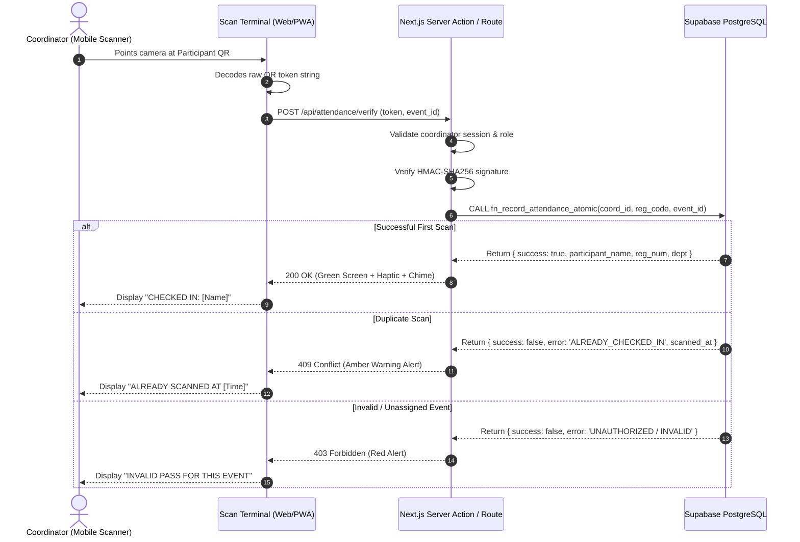

# Attendance & Cryptographic QR Pass Engine

## 1. QR Pass Security & Cryptographic Signing

The QR pass displayed on the participant's device is not a raw database key or plain email. It is a signed, tamper-evident cryptographic token.

### 1.1 Token Payload Structure
```typescript
interface QrTokenPayload {
  r: string; // Registration Code (e.g. "EUPH-26-A8K9M2")
  e: string; // Event UUID
  u: string; // User UUID
  t: number; // Issued at timestamp (epoch ms)
  n: string; // Nonce (unique per registration)
}
```

### 1.2 Signature Generation & Verification
- **Generation**:
  `PayloadString = Base64UrlEncode(JSON.stringify(payload))`
  `Signature = Base64UrlEncode(HMAC_SHA256(PayloadString, QR_SIGNING_SECRET + nonce))`
  `QR_Token = PayloadString + "." + Signature`
- **Tamper Resistance**: If a participant modifies the event ID, registration code, or timestamp, the HMAC verification fails instantly.
- **Replay Protection**: The `nonce` is stored in `event_registrations.qr_secret_nonce`.

---

## 2. Event-Day Coordinator Verification Flow



---

## 3. Fallback Manual Lookup

If camera scanning is impaired by cracked phone screens or low-light auditorium environments:
1. Coordinator switches to **"Manual Search"** tab.
2. Inputs Participant Register Number (Internal) or Email / Registration Code.
3. System fetches participant registration for that specific event.
4. Coordinator taps **"Confirm Check-In"** (logged as `scan_method = 'manual_search'`).
