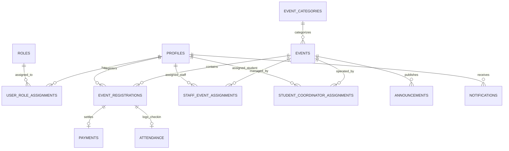

# Database Architecture, Schema & ER Relationships

## 1. Entity Relationship (ER) Diagram



---

## 2. Core Tables Specification

### 2.1 `profiles`
Stores extended user profile information linked directly to `auth.users(id)`.

| Column | Type | Constraints | Description |
| :--- | :--- | :--- | :--- |
| `id` | `uuid` | PK, FK -> `auth.users.id` ON DELETE CASCADE | Unique user identifier |
| `email` | `text` | NOT NULL, UNIQUE | User email address |
| `full_name` | `text` | NOT NULL | User's full name |
| `mobile_number` | `text` | NOT NULL | Contact number |
| `participant_type` | `text` | NOT NULL, CHECK in (`'internal'`, `'external'`) | Derived from email domain (`@klu.ac.in`) |
| `register_number` | `text` | NULL | Student register / roll number (internal) |
| `school` | `text` | NULL | University School (e.g. SAS, SCSE) (internal) |
| `college_name` | `text` | NULL | External institution name |
| `course` | `text` | NULL | Degree/Program (e.g. B.Tech, MCA, B.Sc) |
| `department` | `text` | NOT NULL | Academic department |
| `year_of_study` | `int` | NOT NULL, CHECK (`year_of_study` BETWEEN 1 AND 5) | Year (1, 2, 3, 4, 5) |
| `avatar_url` | `text` | NULL | Optional profile photo |
| `is_profile_completed`| `boolean` | NOT NULL DEFAULT FALSE | Gatekeeper flag |
| `created_at` | `timestamptz`| NOT NULL DEFAULT now() | Created timestamp |
| `updated_at` | `timestamptz`| NOT NULL DEFAULT now() | Last update timestamp |

### 2.2 `roles` & `user_role_assignments`
Provides flexible, granular role-based access control.

```sql
-- Role types: 'admin', 'staff_coordinator', 'student_coordinator', 'participant'
CREATE TABLE roles (
    id text PRIMARY KEY,
    name text NOT NULL,
    description text
);

CREATE TABLE user_role_assignments (
    id uuid PRIMARY KEY DEFAULT gen_random_uuid(),
    user_id uuid NOT NULL REFERENCES profiles(id) ON DELETE CASCADE,
    role_id text NOT NULL REFERENCES roles(id) ON DELETE CASCADE,
    created_at timestamptz NOT NULL DEFAULT now(),
    UNIQUE(user_id, role_id)
);
```

### 2.3 `event_categories`
Groups technical events into organized clusters.

| Column | Type | Constraints | Description |
| :--- | :--- | :--- | :--- |
| `id` | `uuid` | PK DEFAULT `gen_random_uuid()` | Category ID |
| `name` | `text` | NOT NULL, UNIQUE | Category name (e.g., Coding, Robotics, Web, AI) |
| `slug` | `text` | NOT NULL, UNIQUE | URL-safe slug |
| `description` | `text` | NULL | Category summary |
| `icon` | `text` | NULL | Lucide icon identifier |
| `display_order` | `int` | NOT NULL DEFAULT 0 | Display priority |
| `created_at` | `timestamptz` | NOT NULL DEFAULT now() | Timestamp |

### 2.4 `events`
Master registry for all Euphoria events.

| Column | Type | Constraints | Description |
| :--- | :--- | :--- | :--- |
| `id` | `uuid` | PK DEFAULT `gen_random_uuid()` | Event ID |
| `category_id` | `uuid` | FK -> `event_categories.id` | Event Category |
| `name` | `text` | NOT NULL | Event name |
| `slug` | `text` | NOT NULL, UNIQUE | Unique URL slug |
| `short_description`| `text` | NOT NULL | Card overview |
| `description` | `text` | NOT NULL | Full Markdown description |
| `rules` | `text` | NULL | Rules & guidelines markdown |
| `school_or_dept` | `text` | NOT NULL | Organizing department |
| `venue` | `text` | NOT NULL | Hall / Lab / Auditorium |
| `event_date` | `date` | NOT NULL | Date of event |
| `start_time` | `time` | NOT NULL | Start time |
| `end_time` | `time` | NOT NULL | End time |
| `registration_start` | `timestamptz` | NOT NULL | Registration opening time |
| `registration_end` | `timestamptz` | NOT NULL | Registration closing time |
| `registration_fee` | `numeric(10,2)` | NOT NULL DEFAULT 0.00 | Fee in INR (0.00 = Free) |
| `participant_limit` | `int` | NOT NULL DEFAULT 100 | Max participant capacity |
| `allow_internal` | `boolean` | NOT NULL DEFAULT TRUE | Internal student allowed |
| `allow_external` | `boolean` | NOT NULL DEFAULT TRUE | External student allowed |
| `status` | `text` | NOT NULL DEFAULT `'draft'` | `draft`, `published`, `registration_open`, `registration_closed`, `ongoing`, `completed` |
| `banner_url` | `text` | NULL | Event banner image |
| `created_at` | `timestamptz` | NOT NULL DEFAULT now() | Timestamp |
| `updated_at` | `timestamptz` | NOT NULL DEFAULT now() | Timestamp |

### 2.5 `event_registrations`
Participant registration records.

| Column | Type | Constraints | Description |
| :--- | :--- | :--- | :--- |
| `id` | `uuid` | PK DEFAULT `gen_random_uuid()` | Registration ID |
| `event_id` | `uuid` | NOT NULL, FK -> `events.id` ON DELETE CASCADE | Target Event |
| `user_id` | `uuid` | NOT NULL, FK -> `profiles.id` ON DELETE CASCADE | Registered user |
| `registration_code` | `text` | NOT NULL, UNIQUE | Human readable code (`EUPH-26-XXXXXX`) |
| `status` | `text` | NOT NULL DEFAULT `'pending'` | `'pending'`, `'confirmed'`, `'cancelled'` |
| `payment_status` | `text` | NOT NULL DEFAULT `'not_required'`| `'not_required'`, `'pending'`, `'paid'`, `'failed'`, `'refunded'` |
| `qr_secret_nonce` | `text` | NOT NULL | Unique salt used for QR token validation |
| `created_at` | `timestamptz` | NOT NULL DEFAULT now() | Timestamp |
| `updated_at` | `timestamptz` | NOT NULL DEFAULT now() | Timestamp |
| **CONSTRAINT** | `UNIQUE(event_id, user_id)` | Prevents duplicate event registration per user |

### 2.6 `payments`
Stores payment orders and transaction verification records.

| Column | Type | Constraints | Description |
| :--- | :--- | :--- | :--- |
| `id` | `uuid` | PK DEFAULT `gen_random_uuid()` | Internal payment ID |
| `registration_id` | `uuid` | NOT NULL, UNIQUE, FK -> `event_registrations.id` | Associated registration |
| `amount` | `numeric(10,2)` | NOT NULL | Amount in INR |
| `currency` | `text` | NOT NULL DEFAULT `'INR'` | Currency code |
| `provider` | `text` | NOT NULL | `'mock'`, `'razorpay'`, `'cashfree'`, etc. |
| `order_id` | `text` | NOT NULL, UNIQUE | Provider Order / Ref ID |
| `payment_id` | `text` | NULL | Gateway Transaction ID |
| `status` | `text` | NOT NULL DEFAULT `'pending'` | `'pending'`, `'paid'`, `'failed'`, `'refunded'` |
| `raw_response` | `jsonb` | NULL | Webhook / verification response payload |
| `created_at` | `timestamptz` | NOT NULL DEFAULT now() | Timestamp |
| `updated_at` | `timestamptz` | NOT NULL DEFAULT now() | Timestamp |

### 2.7 `staff_event_assignments` & `student_coordinator_assignments`
Scoped assignment tables for multi-tiered coordination.

```sql
CREATE TABLE staff_event_assignments (
    id uuid PRIMARY KEY DEFAULT gen_random_uuid(),
    event_id uuid NOT NULL REFERENCES events(id) ON DELETE CASCADE,
    user_id uuid NOT NULL REFERENCES profiles(id) ON DELETE CASCADE,
    assigned_by uuid REFERENCES profiles(id),
    created_at timestamptz NOT NULL DEFAULT now(),
    UNIQUE(event_id, user_id)
);

CREATE TABLE student_coordinator_assignments (
    id uuid PRIMARY KEY DEFAULT gen_random_uuid(),
    event_id uuid NOT NULL REFERENCES events(id) ON DELETE CASCADE,
    user_id uuid NOT NULL REFERENCES profiles(id) ON DELETE CASCADE,
    assigned_by uuid REFERENCES profiles(id),
    created_at timestamptz NOT NULL DEFAULT now(),
    UNIQUE(event_id, user_id)
);
```

### 2.8 `attendance`
Immutable record of verified participant check-ins.

| Column | Type | Constraints | Description |
| :--- | :--- | :--- | :--- |
| `id` | `uuid` | PK DEFAULT `gen_random_uuid()` | Attendance record ID |
| `registration_id` | `uuid` | NOT NULL, UNIQUE, FK -> `event_registrations.id` | Single check-in per registration |
| `event_id` | `uuid` | NOT NULL, FK -> `events.id` | Event ID (denormalized for query indexing) |
| `scanned_by` | `uuid` | NOT NULL, FK -> `profiles.id` | Coordinator who verified attendance |
| `scanned_at` | `timestamptz` | NOT NULL DEFAULT now() | Verification timestamp |
| `scan_method` | `text` | NOT NULL DEFAULT `'qr_camera'` | `'qr_camera'` or `'manual_search'` |

### 2.9 `announcements` & `notifications`
In-app communications without SMS/WhatsApp costs.

```sql
CREATE TABLE announcements (
    id uuid PRIMARY KEY DEFAULT gen_random_uuid(),
    event_id uuid REFERENCES events(id) ON DELETE CASCADE, -- NULL = Global Announcement
    title text NOT NULL,
    content text NOT NULL,
    is_pinned boolean NOT NULL DEFAULT false,
    created_by uuid NOT NULL REFERENCES profiles(id),
    created_at timestamptz NOT NULL DEFAULT now()
);

CREATE TABLE notifications (
    id uuid PRIMARY KEY DEFAULT gen_random_uuid(),
    user_id uuid NOT NULL REFERENCES profiles(id) ON DELETE CASCADE,
    title text NOT NULL,
    message text NOT NULL,
    link_url text,
    is_read boolean NOT NULL DEFAULT false,
    created_at timestamptz NOT NULL DEFAULT now()
);
```

---

## 3. Atomic Database Functions (PL/pgSQL RPC)

### 3.1 Concurrency-Safe Registration (`fn_register_event_atomic`)
```sql
CREATE OR REPLACE FUNCTION fn_register_event_atomic(
    p_user_id uuid,
    p_event_id uuid
)
RETURNS jsonb
LANGUAGE plpgsql
SECURITY DEFINER
AS $$
DECLARE
    v_event RECORD;
    v_profile RECORD;
    v_current_count int;
    v_existing_reg RECORD;
    v_reg_id uuid;
    v_reg_code text;
    v_nonce text;
    v_payment_status text;
    v_reg_status text;
BEGIN
    -- 1. Check user profile completion
    SELECT * INTO v_profile FROM profiles WHERE id = p_user_id;
    IF NOT FOUND OR NOT v_profile.is_profile_completed THEN
        RETURN jsonb_build_object('success', false, 'error', 'PROFILE_INCOMPLETE');
    END IF;

    -- 2. Lock event row to guarantee capacity check serialization
    SELECT * INTO v_event FROM events WHERE id = p_event_id FOR UPDATE;
    IF NOT FOUND THEN
        RETURN jsonb_build_object('success', false, 'error', 'EVENT_NOT_FOUND');
    END IF;

    -- 3. Check event status & window
    IF v_event.status NOT IN ('published', 'registration_open') THEN
        RETURN jsonb_build_object('success', false, 'error', 'REGISTRATION_CLOSED');
    END IF;
    IF now() < v_event.registration_start OR now() > v_event.registration_end THEN
        RETURN jsonb_build_object('success', false, 'error', 'REGISTRATION_WINDOW_EXPIRED');
    END IF;

    -- 4. Check eligibility
    IF v_profile.participant_type = 'internal' AND NOT v_event.allow_internal THEN
        RETURN jsonb_build_object('success', false, 'error', 'INTERNAL_NOT_ALLOWED');
    END IF;
    IF v_profile.participant_type = 'external' AND NOT v_event.allow_external THEN
        RETURN jsonb_build_object('success', false, 'error', 'EXTERNAL_NOT_ALLOWED');
    END IF;

    -- 5. Check duplicate registration
    SELECT * INTO v_existing_reg FROM event_registrations 
    WHERE event_id = p_event_id AND user_id = p_user_id;
    IF FOUND THEN
        RETURN jsonb_build_object('success', false, 'error', 'ALREADY_REGISTERED', 'registration_id', v_existing_reg.id);
    END IF;

    -- 6. Check capacity
    SELECT count(*) INTO v_current_count FROM event_registrations 
    WHERE event_id = p_event_id AND status = 'confirmed';
    IF v_current_count >= v_event.participant_limit THEN
        RETURN jsonb_build_object('success', false, 'error', 'EVENT_CAPACITY_FULL');
    END IF;

    -- 7. Determine status based on fee
    IF v_event.registration_fee <= 0.00 THEN
        v_payment_status := 'not_required';
        v_reg_status := 'confirmed';
    ELSE
        v_payment_status := 'pending';
        v_reg_status := 'pending';
    END IF;

    -- 8. Generate unique registration code and nonce
    v_reg_code := 'EUPH-' || to_char(now(), 'YY') || '-' || upper(substr(md5(random()::text || clock_timestamp()::text), 1, 6));
    v_nonce := encode(gen_random_bytes(16), 'hex');

    -- 9. Insert registration
    INSERT INTO event_registrations (
        event_id, user_id, registration_code, status, payment_status, qr_secret_nonce
    ) VALUES (
        p_event_id, p_user_id, v_reg_code, v_reg_status, v_payment_status, v_nonce
    ) RETURNING id INTO v_reg_id;

    RETURN jsonb_build_object(
        'success', true,
        'registration_id', v_reg_id,
        'registration_code', v_reg_code,
        'status', v_reg_status,
        'payment_required', (v_event.registration_fee > 0.00),
        'fee', v_event.registration_fee
    );
END;
$$;
```

### 3.2 Concurrency-Safe Attendance Check-in (`fn_record_attendance_atomic`)
```sql
CREATE OR REPLACE FUNCTION fn_record_attendance_atomic(
    p_coordinator_id uuid,
    p_registration_code text,
    p_event_id uuid,
    p_scan_method text DEFAULT 'qr_camera'
)
RETURNS jsonb
LANGUAGE plpgsql
SECURITY DEFINER
AS $$
DECLARE
    v_is_authorized boolean;
    v_reg RECORD;
    v_user_profile RECORD;
    v_att RECORD;
BEGIN
    -- 1. Check if coordinator is admin, assigned staff, or assigned student coordinator for this event
    SELECT EXISTS (
        SELECT 1 FROM user_role_assignments WHERE user_id = p_coordinator_id AND role_id = 'admin'
        UNION
        SELECT 1 FROM staff_event_assignments WHERE user_id = p_coordinator_id AND event_id = p_event_id
        UNION
        SELECT 1 FROM student_coordinator_assignments WHERE user_id = p_coordinator_id AND event_id = p_event_id
    ) INTO v_is_authorized;

    IF NOT v_is_authorized THEN
        RETURN jsonb_build_object('success', false, 'error', 'UNAUTHORIZED_FOR_EVENT');
    END IF;

    -- 2. Fetch and lock registration
    SELECT * INTO v_reg FROM event_registrations 
    WHERE registration_code = p_registration_code AND event_id = p_event_id FOR UPDATE;
    
    IF NOT FOUND THEN
        RETURN jsonb_build_object('success', false, 'error', 'REGISTRATION_NOT_FOUND');
    END IF;

    IF v_reg.status != 'confirmed' THEN
        RETURN jsonb_build_object('success', false, 'error', 'REGISTRATION_NOT_CONFIRMED', 'status', v_reg.status);
    END IF;

    -- 3. Check for duplicate attendance
    SELECT * INTO v_att FROM attendance WHERE registration_id = v_reg.id;
    IF FOUND THEN
        SELECT full_name, email, register_number INTO v_user_profile FROM profiles WHERE id = v_reg.user_id;
        RETURN jsonb_build_object(
            'success', false,
            'error', 'ALREADY_CHECKED_IN',
            'scanned_at', v_att.scanned_at,
            'participant_name', v_user_profile.full_name
        );
    END IF;

    -- 4. Record attendance
    INSERT INTO attendance (
        registration_id, event_id, scanned_by, scan_method
    ) VALUES (
        v_reg.id, p_event_id, p_coordinator_id, p_scan_method
    );

    SELECT full_name, email, register_number, college_name, department INTO v_user_profile 
    FROM profiles WHERE id = v_reg.user_id;

    RETURN jsonb_build_object(
        'success', true,
        'participant_name', v_user_profile.full_name,
        'register_number', coalesce(v_user_profile.register_number, 'N/A'),
        'college_name', coalesce(v_user_profile.college_name, 'KARE'),
        'department', v_user_profile.department,
        'registration_code', v_reg.registration_code,
        'scanned_at', now()
    );
END;
$$;
```
