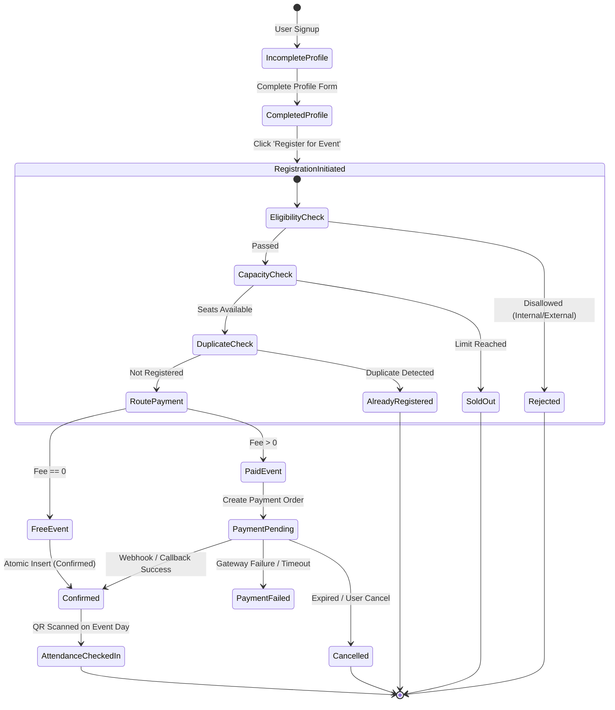

# Registration Lifecycle & State Machine Specification

## 1. Registration State Lifecycle

---

## 2. Concurrency Control & Race Condition Mitigation

1. **Row-Level Locking on Events**: During registration creation, the target `events` row is locked with `FOR UPDATE` inside the PostgreSQL transaction.
2. **Deterministic Capacity Checks**: The confirmed registrations count is executed inside the locked transaction block.
3. **Database Unique Constraints**: `UNIQUE(event_id, user_id)` guarantees at the DB storage layer that two concurrent requests for the same user will fail cleanly.
4. **Idempotent Handlers**: If a network retry occurs, the system safely returns the existing `registration_id` if already booked.

---

## 3. Profile Requirement Rules

### 3.1 Internal Students (`@klu.ac.in`)
- `register_number`: Mandatory (e.g. `9922004001`)
- `school`: Mandatory (Select list: SCSE, SAS, SoM, etc.)
- `department`: Mandatory (e.g. Computer Science, Mechanical)
- `year_of_study`: Mandatory (1, 2, 3, 4, 5)
- `mobile_number`: Mandatory 10-digit format

### 3.2 External Students (Other Domains)
- `college_name`: Mandatory (Institutional affiliation)
- `course`: Mandatory (e.g., B.Tech Information Technology, MCA)
- `department`: Mandatory
- `year_of_study`: Mandatory (1, 2, 3, 4)
- `mobile_number`: Mandatory 10-digit format
